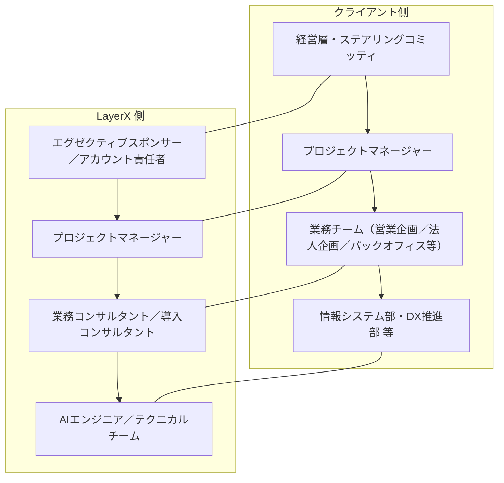

<!--
FILE_NAME: 計画書_YYYYMMDD.md
DESCRIPTION: 実行計画・プロジェクト計画書テンプレート
PURPOSE: 本テンプレートに基づきAIが計画書を生成する際の標準ファイル名となる
-->

# 📘 **AIWorkforce 導入計画書 テンプレート（Markdown）**

---

# **1. 表紙**

```
# AIWorkforce（AIエージェントプラットフォーム）導入計画書
## （クライアント名）様向け
### 作成日：YYYY/MM/DD
### 作成者：（貴社名／プロジェクト名）
```

---

# **2. 本計画書の目的・位置づけ**

## 2.1 目的

* 本計画書は、AIWorkforce（AIエージェントプラットフォーム）を活用した  
  **営業・企画・バックオフィス等の文書起点業務の自動化・高度化プロジェクト** を、  
  具体的なスケジュール・体制・成果物・リスク管理の観点から整理したものです。
* 提案書（例：`AIWorkforce 導入提案書`）で合意した **方針・スコープ・期待効果** を前提に、  
  実行フェーズでのブレを防ぎ、関係者間で共通認識を醸成することを目的とします。

## 2.2 適用範囲

* 対象期間：YYYY/MM 〜 YYYY/MM
* 対象フェーズ：PoC 〜 本番導入・スケール展開
* 対象部門（例）：リテール営業企画部、法人企画部、DX推進部、情報システム部 等

## 2.3 プロジェクトの背景・解決する課題

* 本計画書の対象となる **プロジェクトの背景** を整理します（例：市場・競合動向、社内のDX方針、既存業務の状況 等）。
* 現状の業務プロセスにおける **課題・ボトルネック** を明確化し、本プロジェクトで解決を目指すポイントを記載します。
* 背景と課題を通じて、**本計画書で扱う範囲と優先度付けの前提** を関係者間で共有します。

- 背景：XXX
- 現状の課題：XXX
- 解決したい姿（To-Be）：XXX
- 本プロジェクトで特に重視するポイント：XXX

---

# **3. プロジェクトのゴール・KGI/KPI**

## 3.1 ゴール（定性的）

* 営業・企画・バックオフィスにおける **文書関連業務の大幅な効率化と標準化**
* 部門横断で利用可能な **共通AI基盤（AIWorkforce）** の構築
* PoC での効果検証を踏まえた、**本番導入・全社展開に向けたロードマップの明確化**

## 3.2 KGI（最終的な成果指標の例）

* 対象業務における年間削減工数：XXXX 時間以上
* 営業提案準備時間の削減率：XX〜YY%
* 利用部門数・利用者数：部署数・ユーザー数の目標

## 3.3 KPI（プロジェクト進捗指標の例）

* PoC フェーズ完了時までに検証するユースケース数
* 構築する AIワークフロー数／エージェント数
* ナレッジポータルに登録された文書数・カテゴリ数
* ユーザーアンケートによる満足度・継続利用意向

---

# **4. 対象範囲・スコープ定義**

## 4.1 対象業務

* 対象となる部門・業務領域（例）：
  - リテール営業向け提案資料作成
  - 法人営業の提案書作成・案件ナレッジ管理
  - 支店スタッフ向け FAQ 対応
  - 調査レポート作成・要約

## 4.2 スコープ（含まれるもの）

* PoC で対象とする業務プロセス・ユースケース
* AIワークフロー・エージェントの設計・構築
* ナレッジポータルへの文書取り込み・整理
* 最小限の社内システム連携（必要に応じて）

## 4.3 アウトオブスコープ（含まれないもの）

* 大規模な基幹システム改修・再構築
* 全社展開後の運用センター設計など、長期構想レベルの取り組み
* PoC 期間外に実施予定の追加ユースケース

---

# **5. プロジェクト体制**

## 5.1 体制図（例）

* クライアント側と LayerX 側の **2つのライン** を明確に分け、それぞれの縦の関係（上位〜現場）と、同じレイヤー同士の横の関係が分かるように体制図を記載します。
* 以下は、Mermaid 記法を用いた体制図の例です（実際のプロジェクトに合わせてノード名・関係線を編集してください）。  
  **左側にクライアント、右側に LayerX** を横並びに配置し、それぞれの中では縦方向に体制を表現します（クライアントと LayerX の間に上下関係はありません）。



## 5.2 役割と責任（RACI 例）

* 要件定義、ナレッジ整理、ワークフロー設計、環境構築、テスト、教育・展開などの  
  タスクに対して、R（Responsible）/A（Accountable）/C（Consulted）/I（Informed）を整理。

---

# **6. フェーズ構成とスケジュール**

## 6.1 フェーズ構成（例）

例として、以下のようなフェーズ構成を想定します（実際のプロジェクトに合わせて編集してください）。

| フェーズ  | 名称                       | 概要                                               |
|----------|----------------------------|----------------------------------------------------|
| フェーズ0 | 準備・キックオフ           | 体制構築、ユースケース候補整理、プロジェクト計画の策定 |
| フェーズ1 | PoC 設計・実行             | PoC 対象設計、環境構築、検証用ワークフロー実装と効果測定 |
| フェーズ2 | 本番導入設計               | 本番スコープ確定、アーキテクチャ設計、運用・ガバナンス設計 |
| フェーズ3 | 本番環境構築・移行         | 本番環境構築、データ・ナレッジ移行、受入テスト・稼働確認   |
| フェーズ4 | スケール展開・定着化       | 利用部門拡大、トレーニング、改善サイクル・定着化施策の実施 |

## 6.2 マスタースケジュール（ガントチャートイメージ）

* 月次・週次単位での主要マイルストーンを定義
* 例：

```
Month 1：キックオフ・要件整理・環境準備  
Month 2：PoC 構築・内部テスト  
Month 3：ユーザーテスト・効果測定・本番導入計画確定  
Month 4〜：本番構築・移行・トレーニング・スケール展開
```

---

# **7. フェーズ別タスク・成果物**

## 7.1 フェーズ0：準備・キックオフ

* タスク例：
  - 関係者・体制の確定
  - 対象ユースケース候補の洗い出し
  - 既存資料・システムの棚卸し
* 主な成果物：
  - プロジェクト計画書（本ドキュメント）
  - ユースケース候補一覧

## 7.2 フェーズ1：PoC 設計・実行

* タスク例：
  - PoC 対象ユースケースの選定・詳細化
  - 必要ナレッジ・文書の収集・クレンジング
  - AIワークフロー・エージェントの設計・構築
  - PoC 実行と効果測定
* 主な成果物：
  - PoC 実施計画書
  - PoC 環境構成定義
  - PoC 結果報告書

## 7.3 フェーズ2：本番導入設計

* タスク例：
  - 本番利用スコープ・ユースケースの確定
  - 本番環境アーキテクチャ（Single-Tenant／顧客テナント）の設計
  - 運用プロセス・ガバナンス（承認フロー・権限管理・ログ管理）の設計
* 主な成果物：
  - 本番導入計画書
  - 運用設計書・ガバナンス設計書

## 7.4 フェーズ3：本番環境構築・移行

* タスク例：
  - Azure 環境構築・ネットワーク設定（VPN/Private Link 等）
  - AIWorkforce アプリケーションのデプロイ
  - ナレッジ・ワークフローの本番反映
  - 受入テスト・稼働確認
* 主な成果物：
  - 本番環境構成図
  - テスト結果報告書

## 7.5 フェーズ4：スケール展開・定着化

* タスク例：
  - 利用部門の拡大計画策定
  - トレーニング・ハンズオンの実施
  - 利用状況モニタリングと改善サイクル構築
* 主な成果物：
  - 展開計画書・教育計画書
  - 運用レポート・KPI レポート

---

# **8. 環境構成・技術要件**

## 8.1 インフラ構成要件（例）

* クラウド基盤：Microsoft Azure
* ネットワーク：VPN／PrivateLink／閉域構成
* コンピュート・ストレージ要件

## 8.2 アプリケーション構成要件

* AIWorkforce の構成要素（Webアプリ、API、ワークフローエンジン等）
* 利用する Azure AI サービス（Azure OpenAI, Document Intelligence, AI Search 等）

## 8.3 非機能要件

* 可用性・性能要件
* バックアップ／DR 方針
* 監視・アラート要件

---

# **9. ナレッジ・データ準備計画**

## 9.1 対象ナレッジの洗い出し

* 市場レポート、投信レポート、社内提案書、マニュアル・規程類 等

## 9.2 データ整備・クレンジング

* フォーマット統一、メタデータ付与、アクセス権限整理

## 9.3 ナレッジポータルへの登録・更新フロー

* 初期登録手順
* 以降の更新・追加の運用フロー

---

# **10. セキュリティ・ガバナンス計画**

## 10.1 アクセス制御・権限設計

* 認証方式（SSO 等）
* 部門・ロールごとの閲覧・実行権限

## 10.2 ログ・監査対応

* 操作ログ・エージェント実行ログの取得と保管
* 監査対応時のログ検索・エクスポート手順

## 10.3 AI リスク管理

* 幻覚対策（根拠提示、RAG 利用）
* レビュー・承認フローの運用

---

# **11. コミュニケーション・変更管理**

## 11.1 コミュニケーション計画

* 定例会（ステアリングコミッティ／PJ定例）の頻度・参加者
* 共有資料・議事録の管理方法

## 11.2 変更管理プロセス

* スコープ変更・要件変更の申請〜承認フロー
* 影響分析・リスク評価の進め方

---

# **12. リスクと対策**

## 12.1 想定リスク

* 要件定義の遅延、PoC 効果が十分に出ない、ナレッジ準備の遅れ、
  組織側の受け入れ準備不足、セキュリティレビューの長期化 等

## 12.2 リスク別対策案

* 主要リスクごとに、予防策・発生時対応を整理

---
