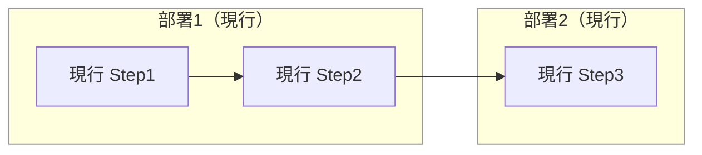
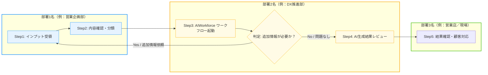
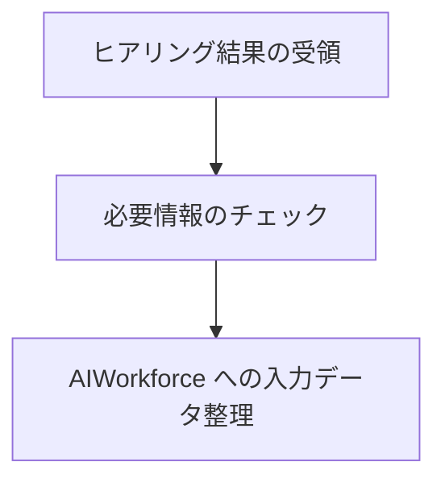

# 📘 **To-Be 業務フロー定義書 テンプレート（Markdown + Mermaid）**

---

## 1. 表紙・メタ情報

```markdown
# AIWorkforce 導入 To-Be 業務フロー定義書
## （プロジェクト名／ユースケース名）
### 作成日：YYYY/MM/DD
### 作成者：（部門名／担当者名）
### 対象部門：営業企画部／DX推進部／情報システム部 など
```

---

## 2. ドキュメント概要

- **目的**:  
  - As-Is 業務フローからの改善ポイントを明確化し、AIWorkforce を前提とした **To-Be 業務フロー** を定義する。  
- **対象範囲**:  
  - 対象ユースケース、対象部門、対象チャネル（店舗／非対面 等）を記載。  
- **前提となるドキュメント**:  
  - `@docs/01_proposal/output/...`（提案書）  
  - `@docs/02_plan/output/...`（計画書）  
  - `@docs/03_requirement/output/...`（要件定義書）  

---

## 3. As-Is 業務フロー概要（任意）

### 3.1 テキストによる概要

- 現行の業務手順・関係部署・主要な課題を簡潔に記載する。

### 3.2 As-Is フロー（Mermaid 図：任意）



---

## 4. To-Be 業務フロー全体図（Mermaid）

Mermaid フローチャート構文の詳細は [Mermaid Flowchart ドキュメント](https://mermaid.js.org/syntax/flowchart.html) を参照。  
ここでは、**部署（スイムレーン）× ステップ × ハンドオフ** が分かることを重視する。



> メモ：  
> - ノードID（例: `D1_S1`）には、「部署番号 + ステップ番号」を含めると、レビュー時の参照がしやすくなる。  
> - 条件分岐には `{}`（ダイアモンド）ノードを用い、Yes/No ラベル付き矢印を使う。  

---

## 5. 部署別詳細フロー（必要に応じて複数図）

### 5.1 部署1 詳細フロー（例）



同様に、部署2／部署3 など、詳細を分割した図を必要に応じて追加する。

---

## 6. 業務ルール・例外処理

- **標準フロー**: 上記 To-Be 図で想定している標準パターンを記載。  
- **例外フロー**:  
  - AI が処理できないパターン  
  - 人手での対応が必要となる条件  
  - 再実行・再生成のルール  

必要に応じて、例外フロー専用の Mermaid 図を追加してもよい。

---

## 7. 入出力・システム連携ポイント

- **インプット**:  
  - どの部署・どのシステムから、どのようなデータを受け取るか。  
- **アウトプット**:  
  - どの部署・どのシステムへ、どのような形式で結果を渡すか。  
- **AIWorkforce との関係**:  
  - どのステップで AIWorkforce のワークフロー／エージェントが起動されるか。  

必要に応じて、システム連携フローを別の Mermaid 図として定義してもよい。

---

## 8. 役割分担・ハンドオフ

- 各ステップにおける **担当部署／担当ロール** を明確にする。  
- ハンドオフ（部署間の受け渡し）ポイントを明示し、  
  Mermaid 図上でも矢印・コメントで分かるようにする。  

---

## 9. 改善ポイント・期待効果

- As-Is との比較で改善されるポイントを、  
  - リードタイム  
  - 工数  
  - エラーリスク  
  - 顧客体験  
  の観点で整理する。  

---

## 10. リスク・留意点

- To-Be フローに伴う運用・ガバナンス上のリスクや留意事項を列挙する。  
- リスクに対する暫定対策・恒久対策を整理する。  

---

## 11. 付録

- 参考：Mermaid フローチャート構文  
  - [Mermaid Flowchart Docs](https://mermaid.js.org/syntax/flowchart.html)  
- 参考：関連ドキュメント  
  - 提案書、計画書、要件定義書 など  

---
