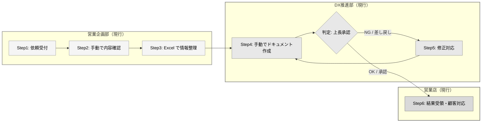
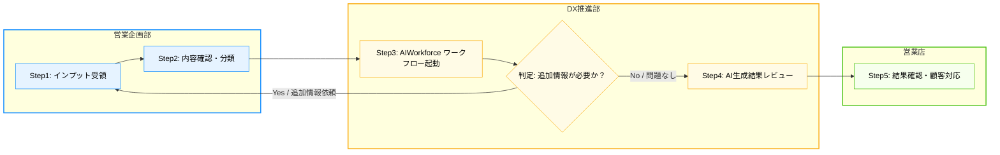
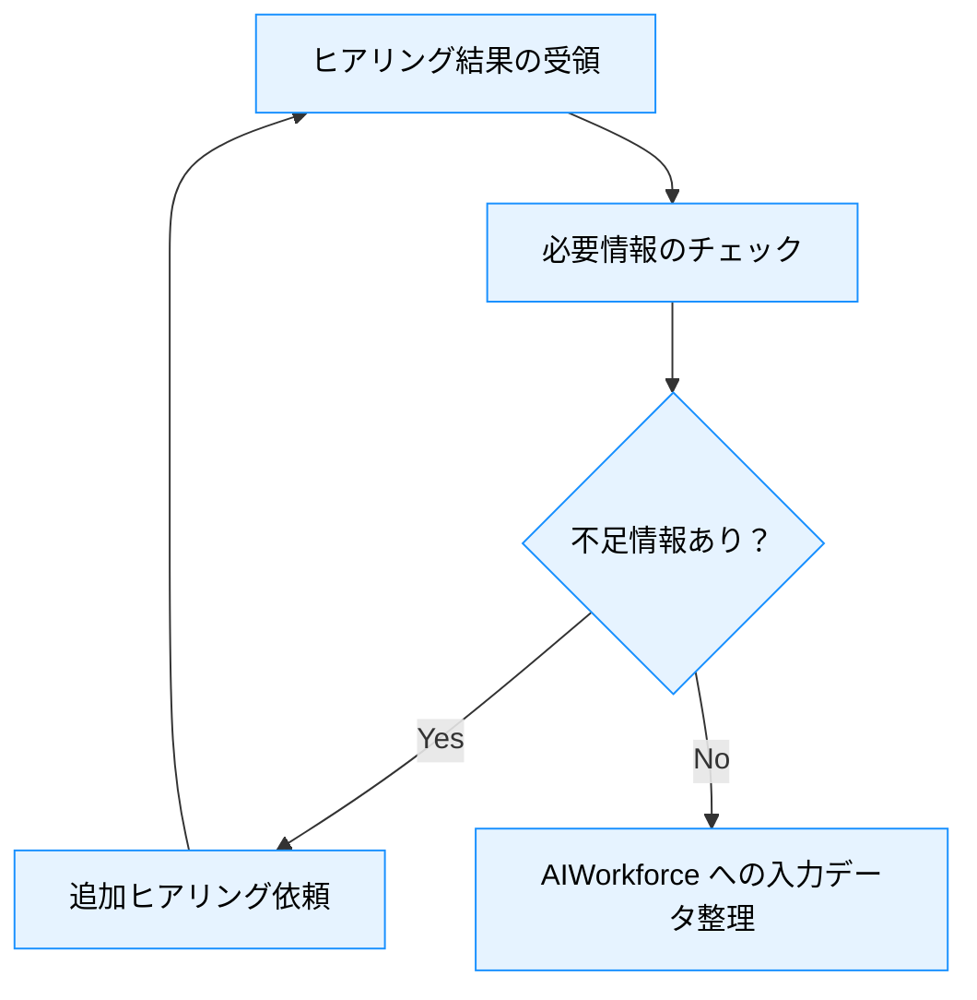
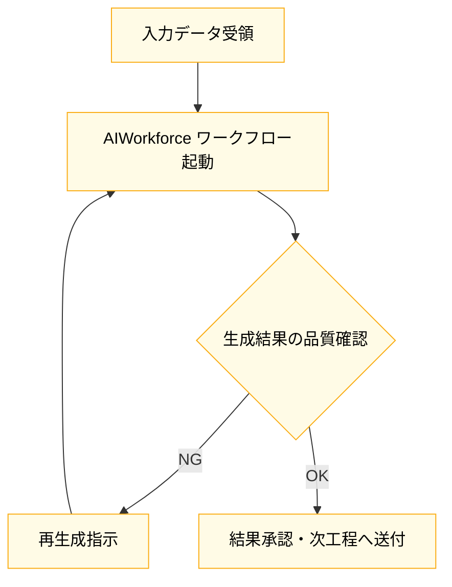

<!--
FILE_NAME: To-Beワークフロー_YYYYMMDD.md
DESCRIPTION: 改善後の業務プロセス定義テンプレート
PURPOSE: 本テンプレートに基づきAIがワークフローを生成する際の標準ファイル名となる
-->

# 📘 **To-Be 業務フロー定義書 テンプレート（Markdown + Mermaid）**

---

## 1. 表紙・メタ情報

```markdown
# AIWorkforce 導入 To-Be 業務フロー定義書
## （プロジェクト名／ユースケース名）
### 作成日：YYYY/MM/DD
### 作成者：（部門名／担当者名）
### 対象部門：営業企画部／DX推進部／情報システム部 など
```

---

## 2. ドキュメント概要

- **目的**:  
  - As-Is 業務フローからの改善ポイントを明確化し、AIWorkforce を前提とした **To-Be 業務フロー** を定義する。  
- **対象範囲**:  
  - 対象ユースケース、対象部門、対象チャネル（店舗／非対面 等）を記載。  
- **前提となるドキュメント**:  
  - `@docs/01_proposal/output/...`（提案書）  
  - `@docs/02_plan/output/...`（計画書）  
  - `@docs/03_requirement/output/...`（要件定義書）  

---

## 3. As-Is 業務フロー概要

現行（As-Is）の業務フローを Mermaid 図で記載する。To-Be との比較を容易にするため、**To-Be と同様の表記ルールを適用すること**。

### ⚠️ 必須ルール（厳守事項）

以下のルールは必ず順守すること。ドラフト生成時にこれらが守られていない場合は評価で減点対象となる。

1. **subgraph のタイトル形式**
   - 必ず `subgraph ID[部署名（現行）]` の形式で記述すること
   - 例: `subgraph AsIs_Dept1[営業企画部（現行）]`、`subgraph AsIs_Dept2[DX推進部（現行）]`
   - 部署名は具体的な名称を記載すること（「部署1」などの抽象的な名称は不可）

2. **ノードID の命名規則**
   - 「AsIs + 部署番号 + ステップ番号」の形式を必ず使用すること
   - 例: `AsIs_D1_S1`（現行の部署1のステップ1）、`AsIs_D2_S3`（現行の部署2のステップ3）
   - **To-Be のノードIDと区別するため、必ず `AsIs_` プレフィックスを付けること**

3. **条件分岐の記法**
   - 条件分岐には `{}` （ダイアモンド）ノードを使用すること
   - Yes/No ラベル付き矢印を必ず使用すること
   - 例: `AsIs_D2_S2{判定: 承認が必要か？}`

4. **スタイル定義（色指定）**
   - **文字色は必ず黒色（`color:#000000`）を指定すること**
   - As-Is はグレー系の色で統一し、To-Be と視覚的に区別すること
   - 以下のカラーパレットを推奨：
     | 部署 | 背景色 | 枠線色 | 文字色 |
     |------|--------|--------|--------|
     | 部署1 | `#f5f5f5` | `#999999` | `#000000` |
     | 部署2 | `#e8e8e8` | `#888888` | `#000000` |
     | 部署3 | `#d9d9d9` | `#777777` | `#000000` |
     | 部署4 | `#cccccc` | `#666666` | `#000000` |

5. **To-Be との対応関係**
   - As-Is の各ステップが To-Be のどのステップに対応するか（または廃止・新規か）を明確にすること
   - セクション9（改善ポイント・期待効果）で対応関係を記載する

### 3.1 As-Is 業務フロー全体図（Mermaid）



### 3.2 As-Is の課題・問題点

As-Is フローにおける課題を、ノードIDを明記して記載する。

| 対象ノードID | ステップ名 | 課題・問題点 |
|-------------|-----------|-------------|
| `AsIs_D1_S2` | 手動で内容確認 | （例）確認漏れが発生しやすい、属人的な判断に依存 |
| `AsIs_D1_S3` | Excel で情報整理 | （例）手作業による転記ミス、フォーマット不統一 |
| `AsIs_D2_S1` | 手動でドキュメント作成 | （例）作成に2日以上かかる、品質にばらつき |
| `AsIs_D2_S2` | 上長承認 | （例）承認待ちで1日以上滞留することがある |
| `AsIs_D2_S3` | 修正対応 | （例）差し戻し率が高い（約30%）、手戻り工数が大きい |

### 📋 必須チェックリスト

ドラフト作成時、以下の項目をすべて満たしていることを確認すること：

- [ ] すべての subgraph に具体的な部署名（現行）が記載されている
- [ ] すべてのノードID が「AsIs + 部署番号 + ステップ番号」形式になっている
- [ ] すべてのノードに `color:#000000`（黒色文字）が指定されている
- [ ] 条件分岐には `{}` ダイアモンドノードを使用している
- [ ] 条件分岐の矢印に Yes/No（または OK/NG 等）ラベルが付いている
- [ ] 各部署のノードにグレー系の統一された背景色・枠線色が適用されている
- [ ] As-Is の課題・問題点がノードIDとともに記載されている
- [ ] To-Be との対応関係が明確になっている（セクション9で記載）

---

## 4. To-Be 業務フロー全体図（Mermaid）

Mermaid フローチャート構文の詳細は [Mermaid Flowchart ドキュメント](https://mermaid.js.org/syntax/flowchart.html) を参照。  
ここでは、**部署（スイムレーン）× ステップ × ハンドオフ** が分かることを重視する。

### ⚠️ 必須ルール（厳守事項）

以下のルールは必ず順守すること。ドラフト生成時にこれらが守られていない場合は評価で減点対象となる。

1. **subgraph のタイトル形式**
   - 必ず `subgraph ID[部署名]` の形式で記述すること
   - 例: `subgraph Dept1[営業企画部]`、`subgraph Dept2[DX推進部]`
   - 部署名は具体的な名称を記載すること（「部署1」などの抽象的な名称は不可）

2. **ノードID の命名規則**
   - 「部署番号 + ステップ番号」の形式を必ず使用すること
   - 例: `D1_S1`（部署1のステップ1）、`D2_S3`（部署2のステップ3）
   - **セクション5（部署別詳細フロー）のノードIDと整合させること**
     - 全体図の `D1_S1` は、詳細フローの `D1_S1_1`, `D1_S1_2`, ... に対応
     - 全体図のステップ数と詳細フローのセクション数が一致すること

3. **条件分岐の記法**
   - 条件分岐には `{}` （ダイアモンド）ノードを使用すること
   - Yes/No ラベル付き矢印を必ず使用すること
   - 例: `D2_S2{判定: 追加情報が必要か？}`

4. **スタイル定義（色指定）**
   - **文字色は必ず黒色（`color:#000000`）を指定すること**
   - 背景色・枠線色は部署ごとに統一すること
   - 以下のカラーパレットを推奨：
     | 部署 | 背景色 | 枠線色 | 文字色 |
     |------|--------|--------|--------|
     | 部署1 | `#e6f3ff` | `#1890ff` | `#000000` |
     | 部署2 | `#fffbe6` | `#faad14` | `#000000` |
     | 部署3 | `#f6ffed` | `#52c41a` | `#000000` |
     | 部署4 | `#fff1f0` | `#ff4d4f` | `#000000` |



### 📋 必須チェックリスト

ドラフト作成時、以下の項目をすべて満たしていることを確認すること：

- [ ] すべての subgraph に具体的な部署名が記載されている
- [ ] すべてのノードID が「部署番号 + ステップ番号」形式になっている
- [ ] すべてのノードに `color:#000000`（黒色文字）が指定されている
- [ ] 条件分岐には `{}` ダイアモンドノードを使用している
- [ ] 条件分岐の矢印に Yes/No ラベルが付いている
- [ ] 各部署のノードに統一された背景色・枠線色が適用されている
- [ ] **全体図のノードID がセクション5（部署別詳細フロー）と整合している**
- [ ] **全体図の各ステップが、対応する詳細フローで展開されている**

---

## 5. 部署別詳細フロー（必要に応じて複数図）

各部署の詳細フローを個別に定義する。全体図（セクション4）で示した各部署の処理を、より詳細なステップに分解して記述する。

### ⚠️ 必須ルール（厳守事項）

以下のルールは必ず順守すること。ドラフト生成時にこれらが守られていない場合は評価で減点対象となる。

1. **セクションタイトルの形式**
   - 必ず `### 5.N 部署名 詳細フロー` の形式で記述すること
   - 例: `### 5.1 営業企画部 詳細フロー`、`### 5.2 DX推進部 詳細フロー`
   - 部署名は具体的な名称を記載すること（「部署1」などの抽象的な名称は不可）

2. **ノードID の命名規則と全体図との整合性**
   - 「部署番号 + ステップ番号 + サブステップ番号」の形式を必ず使用すること
   - 例: `D1_S1_1`, `D1_S1_2`, `D1_S1_3`（部署1のステップ1の詳細サブステップ）
   - **全体図（セクション4）のノードIDと必ず整合させること**
     - 全体図の `D1_S1` → 詳細フローでは `D1_S1_1`, `D1_S1_2`, ... として展開
     - 全体図の `D2_S1` → 詳細フローでは `D2_S1_1`, `D2_S1_2`, ... として展開
   - **全体図に存在しないノードIDを詳細フローで使用しないこと**
   - **全体図の各ステップは、対応する詳細フローで必ず展開すること**

3. **条件分岐の記法**
   - 条件分岐には `{}` （ダイアモンド）ノードを使用すること
   - Yes/No ラベル付き矢印を必ず使用すること

4. **スタイル定義（色指定）**
   - **文字色は必ず黒色（`color:#000000`）を指定すること**
   - 背景色・枠線色は全体図（セクション4）と統一すること
   - 以下のカラーパレットを推奨：
     | 部署 | 背景色 | 枠線色 | 文字色 |
     |------|--------|--------|--------|
     | 部署1 | `#e6f3ff` | `#1890ff` | `#000000` |
     | 部署2 | `#fffbe6` | `#faad14` | `#000000` |
     | 部署3 | `#f6ffed` | `#52c41a` | `#000000` |
     | 部署4 | `#fff1f0` | `#ff4d4f` | `#000000` |

### 5.1 営業企画部 詳細フロー（例）



### 5.2 DX推進部 詳細フロー（例）



同様に、部署3 以降も、詳細を分割した図を必要に応じて追加する。

### 📋 必須チェックリスト

ドラフト作成時、以下の項目をすべて満たしていることを確認すること：

- [ ] すべてのセクションタイトルに具体的な部署名が記載されている
- [ ] すべてのノードID が「部署番号 + ステップ番号 + サブステップ番号」形式になっている
- [ ] すべてのノードに `color:#000000`（黒色文字）が指定されている
- [ ] 条件分岐には `{}` ダイアモンドノードを使用している
- [ ] 条件分岐の矢印に Yes/No（または OK/NG 等）ラベルが付いている
- [ ] 各部署のノードに全体図（セクション4）と統一された背景色・枠線色が適用されている
- [ ] **詳細フローのノードID が全体図（セクション4）のノードIDと整合している**
  - 例: 全体図 `D1_S1` → 詳細フロー `D1_S1_1`, `D1_S1_2`, ...
- [ ] **全体図の各ステップが、対応する詳細フローで漏れなく展開されている**
- [ ] **全体図に存在しないノードIDを詳細フローで使用していない**

---

## 6. 業務ルール・例外処理

特定のステップやノードを参照する際は、**必ずノードID（例: `D1_S1`, `D2_S2`）を明記すること**。

### 6.1 標準フロー

上記 To-Be 図で想定している標準パターンを記載する。

| 対象ノードID | ステップ名 | 業務ルール |
|-------------|-----------|-----------|
| `D1_S1` | インプット受領 | （例）受領後24時間以内に内容確認を開始する |
| `D2_S1` | AIWorkforce ワークフロー起動 | （例）必須項目がすべて揃っていることを確認後に起動 |
| `D2_S2` | 追加情報判定 | （例）不足情報がある場合は依頼元に差し戻し |

### 6.2 例外フロー

| 対象ノードID | 例外条件 | 対応方法 |
|-------------|---------|---------|
| `D2_S1` | AI が処理できないパターン | （例）手動対応フローへ分岐（`D2_S1` → 手動処理ノード） |
| `D2_S3` | 品質基準を満たさない | （例）最大3回まで再生成、それでもNGなら人手レビュー |

必要に応じて、例外フロー専用の Mermaid 図を追加してもよい。

---

## 7. 入出力・システム連携ポイント

特定のステップやノードを参照する際は、**必ずノードID（例: `D1_S1`, `D2_S2`）を明記すること**。

### 7.1 インプット

| 対象ノードID | ステップ名 | 入力元 | データ形式 |
|-------------|-----------|-------|-----------|
| `D1_S1` | インプット受領 | （例）顧客・営業担当 | （例）ヒアリングシート（Excel） |
| `D2_S1` | AIWorkforce 起動 | （例）営業企画部 | （例）整理済み入力データ（JSON） |

### 7.2 アウトプット

| 対象ノードID | ステップ名 | 出力先 | データ形式 |
|-------------|-----------|-------|-----------|
| `D2_S3` | AI生成結果レビュー | （例）営業店 | （例）提案書ドラフト（PDF） |
| `D3_S1` | 結果確認・顧客対応 | （例）顧客 | （例）最終提案書（PDF） |

### 7.3 AIWorkforce との関係

| 対象ノードID | ステップ名 | AIWorkforce 連携内容 |
|-------------|-----------|---------------------|
| `D2_S1` | AIWorkforce ワークフロー起動 | （例）提案書生成ワークフローを起動 |
| `D2_S2` | 追加情報判定 | （例）AI による入力データ検証 |
| `D2_S3` | AI生成結果レビュー | （例）生成結果の品質スコアリング |

必要に応じて、システム連携フローを別の Mermaid 図として定義してもよい。

---

## 8. 役割分担・ハンドオフ

特定のステップやノードを参照する際は、**必ずノードID（例: `D1_S1`, `D2_S2`）を明記すること**。

### 8.1 ステップ別担当

| 対象ノードID | ステップ名 | 担当部署 | 担当ロール |
|-------------|-----------|---------|-----------|
| `D1_S1` | インプット受領 | 営業企画部 | 企画担当者 |
| `D1_S2` | 内容確認・分類 | 営業企画部 | 企画担当者 |
| `D2_S1` | AIWorkforce 起動 | DX推進部 | AI運用担当者 |
| `D2_S2` | 追加情報判定 | DX推進部 | AI運用担当者 |
| `D2_S3` | AI生成結果レビュー | DX推進部 | AI運用担当者 |
| `D3_S1` | 結果確認・顧客対応 | 営業店 | 営業担当者 |

### 8.2 ハンドオフポイント

| 受け渡し元 | 受け渡し先 | ハンドオフ内容 |
|-----------|-----------|---------------|
| `D1_S2` → `D2_S1` | 営業企画部 → DX推進部 | 整理済み入力データの引き渡し |
| `D2_S3` → `D3_S1` | DX推進部 → 営業店 | AI生成結果の引き渡し |
| `D2_S2` → `D1_S1` | DX推進部 → 営業企画部 | 追加情報依頼（差し戻し） |

---

## 9. 改善ポイント・期待効果

特定のステップやノードを参照する際は、**必ずAs-IsノードIDとTo-BeノードIDの両方を明記すること**。

### 9.1 As-Is → To-Be ステップ対応表

As-Is の各ステップが To-Be のどのステップに対応するかを明記する。

| As-Is ノードID | As-Is ステップ名 | To-Be ノードID | To-Be ステップ名 | 変更内容 |
|---------------|-----------------|---------------|-----------------|---------|
| `AsIs_D1_S1` | 依頼受付 | `D1_S1` | インプット受領 | 受付方法を統一化 |
| `AsIs_D1_S2` | 手動で内容確認 | `D1_S2` | 内容確認・分類 | AI支援による自動分類を導入 |
| `AsIs_D1_S3` | Excel で情報整理 | `D1_S2` | 内容確認・分類 | To-Be では `D1_S2` に統合 |
| `AsIs_D2_S1` | 手動でドキュメント作成 | `D2_S1` | AIWorkforce ワークフロー起動 | AI による自動生成に置換 |
| `AsIs_D2_S2` | 上長承認 | `D2_S2` | 追加情報判定 | 承認プロセスを AI 判定に変更 |
| `AsIs_D2_S3` | 修正対応 | `D2_S3` | AI生成結果レビュー | 手戻りを AI 再生成で対応 |
| `AsIs_D3_S1` | 結果受領・顧客対応 | `D3_S1` | 結果確認・顧客対応 | 大きな変更なし |
| （なし） | （新規） | `D2_S2` | 追加情報判定 | To-Be で新規追加 |

### 9.2 改善効果一覧

As-Is との比較で改善されるポイントを、以下の観点で整理する。

| As-Is ノードID | To-Be ノードID | 改善観点 | As-Is 状態 | To-Be 状態 | 期待効果 |
|---------------|---------------|---------|-----------|-----------|---------|
| `AsIs_D2_S1` | `D2_S1` | リードタイム | 手動作成：2日 | AI生成：30分 | 約95%短縮 |
| `AsIs_D2_S2` → `AsIs_D2_S3` | `D2_S3` | 工数 | レビュー＋修正：4時間 | AI支援レビュー：1時間 | 約75%削減 |
| `AsIs_D1_S2` | `D1_S2` | エラーリスク | 手動分類：ミス率5% | AI分類：ミス率1% | エラー80%削減 |
| `AsIs_D3_S1` | `D3_S1` | 顧客体験 | 提案まで3日 | 提案まで1日 | 顧客満足度向上 |
| `AsIs_D1_S3` | （統合） | 工数 | Excel整理：2時間 | 自動化により廃止 | 100%削減 |

---

## 10. リスク・留意点

特定のステップやノードを参照する際は、**必ずノードID（例: `D1_S1`, `D2_S2`）を明記すること**。

| 対象ノードID | リスク・留意点 | 暫定対策 | 恒久対策 |
|-------------|---------------|---------|---------|
| `D2_S1` | AI生成の品質ばらつき | 人手レビューを必須化 | プロンプト改善・学習データ拡充 |
| `D2_S2` | 判定ロジックの精度 | 閾値を保守的に設定 | 判定モデルの継続改善 |
| `D2_S3` | レビュー担当者の負荷 | 複数担当者でローテーション | レビュー自動化ツール導入 |
| 全体 | システム障害時の業務継続 | 手動フローへの切り替え手順整備 | 冗長構成・DR対策 |

---

## 11. 付録

- 参考：Mermaid フローチャート構文  
  - [Mermaid Flowchart Docs](https://mermaid.js.org/syntax/flowchart.html)  
- 参考：関連ドキュメント  
  - 提案書、計画書、要件定義書 など  

---
